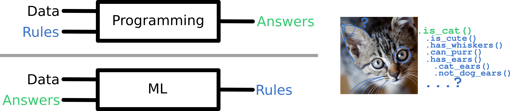

# Willkommen zum KI-Schülerpraktikum 2022

In den nächsten Tagen werden euch einige hands-on Anwendungen dessen, was die Medien gerne als "Künstliche Intelligenz" bezeichnen, tatsächlich aber als "Maschinelles Lernen" bezeichnet werden kann, erwarten.

## Was ist Maschinelles Lernen?

Kurz zusammen gefasst beschreibt Maschinelles Lernen das datengetriebene Anpassen oder Optimieren mathematischer Funktionen, um ein bestimmtes Ziel zu erreichen oder eine bestimmte Aufgabe zu lösen.

Die Struktur und der Aufbau dieser Funktionen ist in der Regel vorgegeben, oder zumindest auf eine gewisse Kategorie eingeschränkt, zb. Abhängig davon ob man eine Support Vector Maschine mit Kernel-Funktion trainieren möchte, oder eine einfache lineare Funktion deren Gewichte angepasst werden müssen, oder ein komplexes und tiefes Neuronales Netz.

Grundsätzlich besteht der Unterschied zwischen klassischer Programmierung und KI darin, dass man bei ersterem die Daten kennt, als auch die Lösungswege (Regeln) um die gewünschten Antworten zu erhalten. Beim Maschinellen Lernen hat man Daten, und zu einigen Datenpunkten die gewünschten Antworten, aber keine explizit bekannten oder umsetzbaren Regeln. Das Ziel ist es, anhand der verfügbaren Beispieldaten einen Prädiktor zu trainieren, welcher Regeln und Transformationen erlernt, um das durch die Daten beschriebene Problem möglichst gut zu lernen. Das daraus entstehende sogenannte "Modell" (ie der Prädiktor) kann dann genutzt werden, um Antworten auf neuen Daten vorherzusagen. Welche Vor- und Nachteile, sowie Eigenschaften dieses Vorgehen hat werden wir hoffentlich im Rahmen des Praktikums noch kennen und verstehen lernen.




# Schritt 0: Die Entwicklungsumgebung einrichten

Wir werden uns zuerst im Sandkasten diverser 2d-Datensätze tummeln und einfache neuronale Netze (oder andere Modelle (die man leider oft nicht so schön beim lernen beobachten kann)) trainieren, evaluieren oder visualisieren.

Der allererste Schritt den ihr gehen müsst, ist das Einrichten einer geeigneten Entwicklungsumgebung. Wir werden Python und (vorwiegend) [JupyterLab](https://jupyter.org/) nutzen um interaktive Notebooks zu programmieren und auszuführen. Darüber hinaus empfehle ich immer gerne [Visual Studio Code](https://code.visualstudio.com/), eine frei verfügbare IDE, mit der sich zb. auch das aktuell betrachtete Notebook oder nicht im interaktiven Jupyter Lab geöffneter plain text Python code öffnen, betrachten und editieren lassen.

Unter der Annahme, dass ihr ein Debian-basiertes Linuxsystem nutzt, ladet bitte das `.deb` -file für VSCode herunter, und installiert den editor mittels von der Konsole aus (Alt+Ctrl+T um eine Instanz zu öffnen)

```
sudo apt install -y ./pfad/zum/deb-file
```

Startet zum testen die Applikation mittels des Befehlts

```
code [opt]
```

wobei [opt] optionale parameter auf ein folder (defaultwert is ".", also das current directory) oder ein file verweisen kann.

## Virtualisierung

Damit wir anderen usern (oder auch Projekten) nicht in die Quere kommen installieren wir Conda, eine Virtualisierungsumgebung für Python. Diese sorgt dafür, dass pro Softwareprojekt separete Dependencies realisiert werden können, ohne dass es zwischen projekten zu Konflikten kommt. Ladet hierzu den 64bit Linux installer von der [Conda homepage](https://docs.conda.io/en/latest/miniconda.html) und installiert diesen via `bash` im user space:

```
bash ./downloaded/miniconda-installer-file.sh
```

Folgt den Prozess, und initialisiert Conda am Ende der Installation. Sollte alles geklappt haben wird beim nächsten geöffneten Terminal (Alt+Ctrl+T) der Text `(base)` zu Beginn der Kommandozeile stehen. Dies ist der Indikator dafür, dass ihr euch gerade in der Basis-Umgebung befindet.


### Eine virtuelle Umgebung einrichten

Nun kommen wir zum letzten Schritt, bevor es ans Maschinelle Lernen geht, dem Einrichten *der* virtuellen Umgebung für euer Projekt. Wir wollen Python3 nutzen, und legen daher mit Conda eine neue Virtuelle Umgebung mit dem folgenden Befehl an, welche ein "Realitätsblase" einer Python-Instanz mit dem Namen "praktikum" auf eurem Rechner anlegt:

```
conda create -n praktikum Python=3
```

Sollte der Befehl erfolgreich durchlaufen seht ihr am Ende im Terminal die Instruktionen zur aktivierung der Umgebung. Aktiviert diese nun, und seht einen string `(praktikum)` am Anfang der Kommandozeile. Gratulation, ihr habt soeben eure Praktikumsrealitätsblase betreten. Hier könnt ihr wild mit den Python-Paketen experimentieren, ohne permanenten Schaden am Linux-Betriebssystem zu verursachen. Im Zweifel werfen wir die `praktikum`-Umgebung einfach weg und bauen sie von Grund auf neu. Eure Dateien werden dabei nicht betroffen sein.


### Python-Pakete einrichten

Stellt nun sicher, dass ihr euch in der virtuellen Umgebung `praktikum` befindet, um nicht aus versehen die `base`-Umgebung zu modifizieren. Zunächst installieren wir Jupyter Lab, eine Browser-basierter interaktiver Python-editor. Führt folgendes aus:

```
pip install jupyterlab
```

`pip` ist ein Paketverwaltungstool für Python, welches es sehr angenehm und einfach macht, Pakete und Abnhängigkeiten aufzulösen. Als nächstes werft einen blick auf [./requirements.txt](./requirements.txt). Öffnet die Datei mit VSCode oder einem anderen editor eurer wahl, oder einfach mit `cat` über das terminal.
Requirements-Dateien sind eine alternative Möglichkeit, Abhängigkeiten bzw benötigte Pakete, die installiert werden sollen, zu sammeln.

#### Macht euch Vertraut
Recherchiert die in der oben gelisteten Requirements-Datei gelisteten Pakete, und findet heraus welchen Nutzen sie bringen. Macht euch mit den Möglichkeiten der Pakete (nur oberflächlich!) vertraut. Was passiert, wenn bereits installierte Pakete erneut installiert werden sollen?


#### Installation

Installiert nun die Pakete mittels pip:
```
pip install -r ./pfad/zur/requirements/datei
```
und testet anschließend, ob alle installierten module in einer Python-Laufzeit importiert werden können, dh, öffnet ein Terminal, startet python mit dem Befehl `python`, und versucht der reihe nach alle Pakete mittels des Befehls `import [paketname]` zu importieren. Wo stoßt ihr auf Hürden? Wie können diese behoben werden? Sobald ihr alle Module erfolgreicht importiert habt beherrscht ihr die fundamentalen Fähigkeiten eines Softwarentwicklers: Google und (vermutlich) StackOverflow zu nutzen.


# Schritt 1: Los geht's

Als nächstes geht es auch schon los mit ML und Datenalyse. Hierzu wechseln wir in die JupyterLab - Umgebung. Stellt vor dem starte sicher, dass ihr euch (1) mit dem Terminal im folder befindet, wo sich unter anderem das Jupyter Notebook [../1_2d-ml/1_2d-machine-learning.ipynb](../1_2d-ml/1_2d-machine-learning.ipynb) befindet (worin es weiter geht. erhaltet ihr per Email), und (2) die virtuelle Praktikums-umgebung aktiviert ist, bevor ihr JupyterLab startet.


